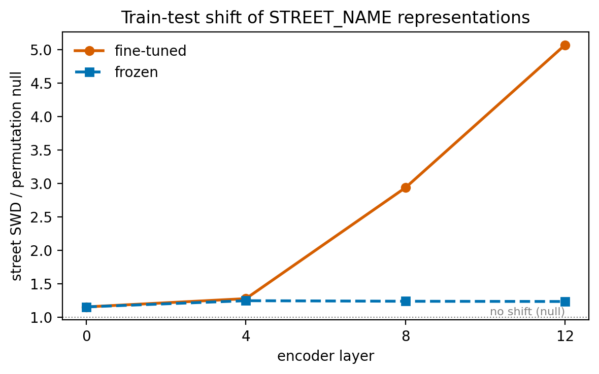
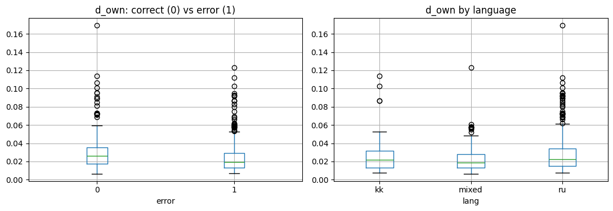

# Representation Shift in Kazakh–Russian NER

**Why does a multilingual NER model fail on street names in Kazakh–Russian public transport complaints?** This repository contains the training pipeline for the model from our IEEE SIST 2026 paper and a follow-up analysis of its representation space with optimal transport and permutation tests.

> A. Ussenbayeva, D. Khussainova, D. Otepova, T. Orazov, D. Rakhimzhanov. *Heterogeneous Entity Extraction for Geotagging and Spatio-Temporal Analysis of Public Transport Complaints.* 2026 IEEE 6th International Conference on Smart Information Systems and Technologies (SIST), Astana, pp. 1–6. DOI: [10.1109/SIST61674.2026.11596166](https://doi.org/10.1109/SIST61674.2026.11596166)

**Status: work in progress.** All results below come from the original train/test split of the paper. Re-running on a stratified split and over several seeds is the next step (see [Roadmap](#roadmap)).

---

## Contents

- [Motivation](#motivation)
- [Key findings](#key-findings)
- [Repository structure](#repository-structure)
- [Data](#data)
- [Quick start](#quick-start)
- [Method](#method)
- [Results](#results)
- [Limitations](#limitations)
- [Roadmap](#roadmap)
- [Citation](#citation)
- [Acknowledgements](#acknowledgements)
- [License](#license)
- [Contact](#contact)

---

## Motivation

Citizens of Astana send complaints about public transport in Russian, Kazakh, and often a mix of both within one message. To map these complaints, the paper fine-tunes XLM-RoBERTa to extract six entity types: route numbers, bus IDs, plate numbers, stop names, street names and street intersections.

Street names were the weakest type (F1 = 0.28 in the paper). The paper attributed this to class scarcity and a train–test distribution shift, and listed language mixing among the difficulties. These explanations were not tested. This project tests them in the encoder's representation space and asks two questions:

1. **Does the position of a complaint in representation space predict NER errors** beyond simple baselines (length, language, model confidence)?
2. **Is the train–test shift for street names real**, or an artifact of small samples? If real, is it caused by the data, by fine-tuning, or by language mixing?

## Key findings

- **The train–test shift for street names is real.** Measured with the sliced Wasserstein distance (SWD) on entity-level representations, it exceeds both a permutation null (random re-splits of the same data) and a size-matched null (stop names subsampled to the same size), at every layer and for both encoders.
- **Fine-tuning amplifies it about fivefold.** In the pre-trained encoder the shift is about 1.2× the permutation null; after fine-tuning it reaches about 5× at the last layer. This is consistent with the model fitting the 46 training street mentions instead of learning what a street name looks like in general.
- **Language mixing is not the main cause.** Complaints with street names have almost the same language composition in train and test, and the shift remains significant within Russian-only complaints.
- **Geometry predicts errors only modestly.** Erroneous complaints are *not* farther from their language centroid; the effect goes the other way and is most likely explained by complaint length. Geometric features add a small gain (+0.028 AUC) on top of model confidence.



*Figure 1. Train–test SWD of street-name mentions divided by its mean under 500 random re-splits (1 = no shift beyond chance). The shift is small in the pre-trained encoder and grows sharply in the upper layers after fine-tuning. Numbers are in [Table 4](#4-statistical-controls-entity-level).*

## Repository structure

```
kazru-ner-representation-shift/
├── notebooks/
│   └── ner_representation_analysis.ipynb   # training, evaluation and all analyses (Parts 1–5)
├── scripts/
│   ├── make_stratified_split.py            # re-split 70/30 with multi-label iterative stratification
│   └── representation_shift_checks.py      # statistical controls for the SWD analysis (cell 17)
├── figures/                                # generated by the notebook
│   ├── 01-street-shift-finetuned-vs-frozen.{png,pdf}
│   ├── 02-d-own-by-error-and-language.{png,pdf}
│   ├── 03-pca-by-language-and-error.{png,pdf}
│   └── 04-umap-by-language-and-error.png
├── requirements.txt
└── README.md
```

Figures are saved as PNG for this page and as PDF for papers. Figures 3 and 4 are exploratory projections and are not used for any conclusion.

## Data

The dataset contains **2,750 manually annotated complaints** in Russian, Kazakh and mixed Kazakh–Russian, split 70/30 into 1,925 train and 825 test complaints. It is **not included** in this repository because of data-sharing restrictions, and `.gitignore` blocks `*.jsonl` and `*.csv` files.

The notebook expects two files, `train.jsonl` and `test.jsonl`, one complaint per line, already tokenized with the `xlm-roberta-base` tokenizer:

```json
{"input_ids": [0, 1234, 5678, 910, 2], "attention_mask": [1, 1, 1, 1, 1], "labels": [-100, 0, 9, -100, -100]}
```

The label is placed on the first subword of each word; other subwords and special tokens get `-100`. Label IDs follow the BIO scheme:

| ID | Label | ID | Label |
|---|---|---|---|
| 0 | O | 7 / 8 | B- / I-STOP_NAME |
| 1 / 2 | B- / I-ROUTE_NUM | 9 / 10 | B- / I-STREET_NAME |
| 3 / 4 | B- / I-BUS_ID | 11 / 12 | B- / I-STREET_INTERSECTION |
| 5 / 6 | B- / I-PLATE_NUM | | |

Test complaints by language (heuristic, see [Method](#method)): Russian 576, mixed 167, Kazakh 82.

## Quick start

The notebook is written for **Google Colab with a GPU runtime** (a free T4 is enough; training takes about 10–20 minutes).

1. Open `notebooks/ner_representation_analysis.ipynb` in Colab and select *Runtime → Change runtime type → T4 GPU*.
2. Upload `train.jsonl` and `test.jsonl` through the Files panel. Cell 4 looks for them in `/content`, `/`, `/content/sample_data` and `/content/drive/MyDrive/ner_data`.
3. Run all cells in order. Figures are written to `figures/`, the SWD table to `swd_checks.csv`.

To run on a stratified split instead of the original one:

```bash
python scripts/make_stratified_split.py --train train.jsonl --test test.jsonl \
    --out_train train_strat.jsonl --out_test test_strat.jsonl --test_size 0.3 --seed 42
```

and set `TRAIN_FILE` / `TEST_FILE` in cell 2. On synthetic data with the same label distribution, the script places 141 complaints with street names in train and 60 in test, instead of 34 and 167.

Outputs can be kept in the committed notebook, but check that none of them shows complaint texts. The notebook as provided prints only counts, metrics and plots.

## Method

### Model

| Setting | Value |
|---|---|
| Encoder | `xlm-roberta-base` (12 layers, ~270M parameters) |
| Head | token classification, BIO tags, 13 labels |
| Optimizer | AdamW, lr 2e-5, weight decay 0.01, linear decay without warm-up |
| Training | batch size 8, 9 epochs (the paper used 10), gradient clipping 1.0 |
| Loss | cross-entropy weighted by inverse label frequency; STREET_NAME weight × 1.6 |
| Evaluation | entity-level exact span match with `seqeval` |

### Analyses

The notebook has five parts:

| Part | Cells | Question | Method |
|---|---|---|---|
| 1 | 1–8 | Reproduce the paper's model | fine-tuning and `seqeval` evaluation |
| 2 | 9–15 | Does geometry predict errors? | distances to language centroids, Spearman correlation, logistic regression with 5-fold CV |
| 3 | 16 | Is there a train–test shift? | complaint-level SWD |
| 4 | 17 | Is the shift real, and where does it come from? | entity-level SWD, permutation test, size-matched null, frozen vs. fine-tuned encoder, language composition |
| 5 | 18 | Are test street names new strings? | exact-match overlap of entity strings |

**Representations.** A complaint is represented by the mean of its token hidden states; an entity mention by the mean of its subword hidden states. Layers 0, 4, 8 and 12 are analyzed. The main plots use layer 12, fixed before looking at the results.

**Language labels.** A word counts as Kazakh if it contains a Kazakh-specific letter (ә, ғ, қ, ң, ө, ұ, ү, і, һ). A complaint is *kk* if more than 60% of its words are Kazakh, *ru* if none are, and *mixed* otherwise.

**Error label.** A complaint is erroneous if its entity-level F1 is below 1, that is, if at least one of its entities is missed, extra or has wrong boundaries or type.

**Sliced Wasserstein distance.** SWD compares two sets of vectors by projecting them onto many random directions and averaging the one-dimensional optimal transport cost; we use 200 projections from the POT library. Because SWD is biased upward for small samples, every value is compared with two null distributions:
- **permutation null:** pool the train and test mentions, re-split them randomly 500 times with the original sizes, and recompute SWD;
- **size-matched null:** compute the SWD of stop names on 200 random subsamples of the same size as the street-name sets.

## Results

All numbers are from the original split. Per-class F1 varies between runs because GPU training is not fully deterministic; sections 2–5 come from a single run.

### 1. NER performance

| Entity type | Precision | Recall | F1 (latest run) | F1 range, 3 runs | F1 in the paper |
|---|---|---|---|---|---|
| ROUTE_NUM | 0.874 | 0.961 | 0.916 | 0.916–0.922 | 0.920 |
| BUS_ID | 0.899 | 0.639 | 0.747 | 0.735–0.751 | 0.649 |
| PLATE_NUM | 0.534 | 0.854 | 0.657 | 0.643–0.657 | 0.603 |
| STOP_NAME | 0.526 | 0.830 | 0.644 | 0.633–0.644 | 0.640 |
| STREET_NAME | 0.316 | 0.207 | 0.250 | 0.218–0.294 | 0.282 |
| STREET_INTERSECTION | 0 | 0 | 0 | 0 | – |

Micro-F1 = 0.727. STREET_INTERSECTION has only 2 training and 6 test complaints and is never predicted. STOP_NAME has high recall but low precision, which is consistent with street names being tagged as stops (the paper reports 50 such confusions).

### 2. Representation geometry vs. errors

59.5% of test complaints contain at least one error.

**Distance to the language centroid.** Hypothesis: erroneous complaints lie farther from the centroid of their language, computed on the training set. For *mixed* complaints the nearer of the Russian and Kazakh centroids is used. Spearman correlation between this distance and complaint-level F1:

| Layer | 0 | 4 | 8 | 12 |
|---|---|---|---|---|
| ρ | +0.113 | +0.171 | +0.196 | +0.087 |

The sign is positive at every layer, so the hypothesis is **not supported**: erroneous complaints are slightly *closer* to the centroid. The most likely reason is length. Mean-pooling over many tokens moves a long complaint toward the average, and long complaints contain more entities, so they are more likely to contain at least one error.



*Figure 2. Cosine distance from each test complaint to the training centroid of its language (layer 12). Left: erroneous complaints are not farther from the centroid. Right: by language. For mixed complaints the distance to the nearer centroid is used, so their values are lower by construction and should not be compared directly with ru and kk.*

**Predicting errors.** Logistic regression, 5-fold stratified cross-validation, ROC-AUC:

| Features | AUC |
|---|---|
| length + number of entities | 0.683 |
| + language | 0.695 |
| + model confidence | 0.801 |
| geometry only (distances and centroid gaps, 4 layers) | 0.693 |
| geometry + all of the above | 0.829 |

Geometry alone is no better than length and number of entities, but it adds +0.028 AUC on top of model confidence. Geometry-only AUC within languages: ru 0.705 (n = 576), mixed 0.665 (n = 167), kk 0.805 (n = 82, too small to be reliable).

### 3. Train–test shift (complaint level)

SWD between train and test complaint embeddings at layer 12:

| Comparison | n (train / test) | SWD |
|---|---|---|
| complaints with STOP_NAME | 1,616 / 462 | 0.042 |
| complaints with STREET_NAME | 34 / 167 | 0.137 |
| *reference:* Russian complaints, train vs. test | – / 576 | 0.043 |
| *reference:* Russian vs. Kazakh complaints, test | 576 / 82 | 0.072 |

The shift for complaints with street names is about three times that for stop names and larger than the difference between Russian and Kazakh complaints. Because SWD is inflated at small sample sizes, this comparison alone is not conclusive. Section 4 adds the controls.

### 4. Statistical controls (entity level)

Each street or stop mention is represented by the mean of its subword hidden states: 46 street mentions in train, 208 in test. For each encoder and layer: the observed street SWD, its mean under 500 random re-splits (permutation null), the permutation p-value, and the 95th percentile of stop-name SWD on 200 subsamples of the same size (size-matched null).

| Encoder | Layer | Street SWD | Permutation null | Ratio | p | Stop, size-matched 95th pct. |
|---|---|---|---|---|---|---|
| fine-tuned | 0 | 0.046 | 0.040 | 1.2 | 0.010 | 0.042 |
| fine-tuned | 4 | 0.114 | 0.089 | 1.3 | < 0.002 | 0.095 |
| fine-tuned | 8 | 0.282 | 0.096 | 2.9 | < 0.002 | 0.115 |
| fine-tuned | 12 | 0.669 | 0.132 | 5.1 | < 0.002 | 0.203 |
| frozen | 0 | 0.046 | 0.040 | 1.2 | 0.012 | 0.041 |
| frozen | 4 | 0.110 | 0.088 | 1.3 | 0.004 | 0.092 |
| frozen | 8 | 0.113 | 0.091 | 1.2 | < 0.002 | 0.098 |
| frozen | 12 | 0.026 | 0.021 | 1.2 | < 0.002 | 0.022 |

p < 0.002 is the smallest value that 500 permutations can resolve. SWD values are comparable within a layer, not across layers; the ratio column (plotted in Figure 1) is comparable across layers.

- **The shift is not a small-sample artifact.** The street SWD exceeds the permutation null and the size-matched null for both encoders at every layer.
- **Most of it comes from fine-tuning.** In the frozen encoder the ratio stays at 1.2–1.3 at all layers. In the fine-tuned encoder it grows to 2.9 at layer 8 and 5.1 at layer 12, the layers that change most during fine-tuning.
- **A sanity check passes.** Layer 0 gives identical values for both encoders, as expected, since fine-tuning barely changes the input embeddings.
- **The shift is already present at layer 0**, which mostly reflects the words themselves. This suggests that test street names are different strings from training street names (tested in section 6).

### 5. Is language mixing the cause?

Language composition of complaints with street names:

| Split | n | ru | mixed | kk |
|---|---|---|---|---|
| train | 34 | 71% | 21% | 9% |
| test | 167 | 73% | 22% | 5% |

The composition is nearly the same, and within Russian-only complaints the shift stays significant (layer 12: SWD = 0.138 vs. permutation null 0.058, p < 0.002). **Language mixing does not explain the shift.** This contradicts one of the original hypotheses of this project.

### 6. Lexical novelty

Cell 18 compares the share of test mentions whose exact lower-cased string also occurs in train, for street names vs. stop names. *Results pending.*

### Relation to the paper

The paper explained the low STREET_NAME score by class scarcity and a train–test shift, without testing either. This analysis **confirms the shift statistically**, shows that **fine-tuning amplifies it about fivefold**, and finds **no support for language mixing** as its cause.

## Limitations

- **Uneven split.** The published split was meant to be stratified, but only 34 complaints with street names are in train and 167 in test (and 2 / 6 for intersections). The shift measured here is a property of this split. `scripts/make_stratified_split.py` produces a stratified split for re-running the analysis.
- **Single split, few runs.** Per-class F1 varies between runs; sections 2–5 come from one run.
- **No validation set.** The number of epochs and the STREET_NAME weight were effectively tuned on the test set, so test scores are likely optimistic.
- **Heuristic language labels.** Kazakh words without Kazakh-specific letters are counted as Russian, and a *mixed* complaint is often a Russian complaint containing a Kazakh place name.
- **Error definition.** A complaint counts as erroneous if any of its entities is wrong, which ties errors to the number of entities and partly explains the length effect in section 2.
- **Projections are illustrative.** The PCA and UMAP plots in `figures/` show only 2 of 768 dimensions; no conclusion relies on them.

## Roadmap

- [x] Reproduce the paper's model and per-type F1
- [x] Test whether representation geometry predicts errors
- [x] Measure the train–test shift with SWD and validate it with permutation and size-matched nulls
- [x] Separate data shift from fine-tuning (frozen vs. fine-tuned encoder)
- [x] Test language mixing as a cause
- [ ] Report lexical novelty of test entity strings (cell 18)
- [ ] Re-run everything on the stratified split, over at least 3 seeds, with a validation set
- [ ] Analyze errors at the entity level instead of the complaint level
- [ ] Correct the shift: align train and test representations with unbalanced optimal transport and compare with full fine-tuning, LoRA, CORAL and balanced OT, on this corpus and on KazNERD

## Citation

If you use this code, please cite the paper:

```bibtex
@inproceedings{ussenbayeva2026heterogeneous,
  author    = {Ussenbayeva, Ayana and Khussainova, D. and Otepova, D. and Orazov, T. and Rakhimzhanov, Daniyar},
  title     = {Heterogeneous Entity Extraction for Geotagging and Spatio-Temporal Analysis of Public Transport Complaints},
  booktitle = {2026 IEEE 6th International Conference on Smart Information Systems and Technologies (SIST)},
  address   = {Astana, Kazakhstan},
  pages     = {1--6},
  year      = {2026},
  doi       = {10.1109/SIST61674.2026.11596166}
}
```

## References

- A. Conneau et al. *Unsupervised Cross-lingual Representation Learning at Scale.* ACL 2020. (XLM-RoBERTa.)
- N. Bonneel, J. Rabin, G. Peyré, H. Pfister. *Sliced and Radon Wasserstein Barycenters of Measures.* Journal of Mathematical Imaging and Vision 51, 2015. (Sliced Wasserstein distance.)
- R. Flamary et al. *POT: Python Optimal Transport.* JMLR 22(78), 2021.
- Y. Lin et al. *Towards Understanding Jailbreak Attacks in LLMs: A Representation Space Analysis.* EMNLP 2024. (Representation-space analysis adapted in section 2.)
- K. Sechidis, G. Tsoumakas, I. Vlahavas. *On the Stratification of Multi-Label Data.* ECML PKDD 2011. (Iterative stratification.)
- R. Yeshpanov, Y. Khassanov, H. A. Varol. *KazNERD: Kazakh Named Entity Recognition Dataset.* LREC 2022.
- H. Nakayama. *seqeval: A Python framework for sequence labeling evaluation.* 2018. https://github.com/chakki-works/seqeval
- L. McInnes, J. Healy, J. Melville. *UMAP: Uniform Manifold Approximation and Projection for Dimension Reduction.* arXiv:1802.03426, 2018.

## Acknowledgements

The annotated dataset and the original model were developed within grant BR24992852 of the Science Committee of the Ministry of Science and Higher Education of the Republic of Kazakhstan, under the supervision of Daniyar Rakhimzhanov (Astana IT University). I thank my co-authors for the annotation work.

## License

No license has been chosen yet, so all rights are reserved for now. Please contact the author before reusing the code. The data are not distributed.

## Contact

Ayana Ussenbayeva · ayannnna31@gmail.com · ORCID [0009-0004-1344-8477](https://orcid.org/0009-0004-1344-8477)
